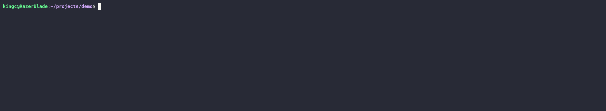

# ai_sast

Deterministic C++ static analysis with optional AI-assisted review for ambiguous findings.

`ai_sast` is a C++-first SAST MVP built around a simple rule: matching a risky pattern is not enough. The engine generates candidates, validates safety barriers, and only then decides whether a finding is confirmed, likely, ambiguous, or safe.



**At a glance**

- Deterministic scanner is the source of truth
- Clang LibTooling frontend with C++20 build support
- JSON, SARIF, and human-readable text output
- Explicit outcomes: `confirmed_issue`, `likely_issue`, `needs_review`, `likely_safe`, `safe_suppressed`
- Optional local AI review through `llm_gateway` for ambiguous or high-value findings only
- Current focus: command execution misuse, path traversal, and dangerous buffer/string handling

## Overview

`ai_sast` is designed for teams that want a static analysis tool to do more than pattern match sinks. The core engine extracts facts from C++ source with Clang, creates candidate findings, validates them against safety evidence, and emits a deterministic result. An optional LLM sidecar can add concise reasoning and remediation for findings that are still uncertain after deterministic validation.

**Why this is different**

- The deterministic engine owns the final result. The LLM does not replace the scanner.
- Safe outcomes are first-class. The engine is allowed to say “this appears safe” or “this was explicitly dismissed.”
- Findings are structured around proof quality, not just sink matches.
- The current architecture is CLI-first, testable, and automation-friendly.

This repository is already usable as a working MVP. It is not a full whole-program verifier, and it does not claim perfect precision. It is a practical, deterministic-first security tool with a narrow, explicit AI integration boundary.

## Demo

The built-in demo walks through all five deterministic outcomes on curated examples:

- `confirmed_issue`
- `likely_issue`
- `needs_review`
- `likely_safe`
- `safe_suppressed`

Run it:

```bash
cmake --build --preset clang18-debug
./build/sast-cli demo
```

JSON demo output:

```bash
./build/sast-cli demo --format json --out build/demo.json
jq '.' build/demo.json
```

Optional advisory LLM enrichment for eligible demo cases:

```bash
./build/sast-cli demo \
  --llm-review \
  --llm-gateway http://127.0.0.1:8081
```

The demo is intentionally small and curated. It shows how the engine behaves on representative cases. It is not a claim of complete proof across arbitrary repositories.

Single-file mixed demo case:

```bash
./build/sast-cli scan --repo tests/demo/mixed_case --format text
```

That file is designed to show three outcomes from one readable C++ source file:

- one confirmed unsafe path
- one suspicious-looking path that is deterministically dismissed as safe
- one ambiguous path that still requires review

## Interactive Terminal Mode

The CLI also includes an interactive text launcher:

```bash
./build/sast-cli interactive
```

It shows:

- a branded startup banner
- engine status
- gateway detection status
- the active local model when the gateway is reachable
- a menu for repository scans, single-file scans, demos, and setup/tutorial help

The launcher is terminal-only by design. It will not show the banner when:

- `--format json` is requested
- `--format sarif` is requested
- `CI` is set
- stdout is not a terminal

The interactive mode is a thin launcher over the existing commands. It does not change the scan pipeline, validators, JSON output, or SARIF output.

## Key Features

- Deterministic C++ scanning with Clang LibTooling
- Candidate -> validate -> decide workflow
- Config-backed sources, sinks, sanitizers, wrappers, and suppressions
- Compile database discovery plus synthetic fallback for standalone source trees
- JSON, SARIF 2.1.0, and text reporting
- Changed-files-only scan mode
- Regression fixtures and benchmark smoke harness
- Optional local LLM review through FastAPI + Ollama
- Structured schema validation and fallback behavior for LLM responses

## Detection Pipeline

The active scan path is:

1. CLI loads the repo path and scan options.
2. The engine discovers `compile_commands.json` or falls back to synthetic compile commands.
3. Clang LibTooling parses translation units and extracts facts:
   - functions
   - call sites
   - variable references
   - local variable definitions
   - source locations
4. Candidate detection matches configured sinks and traces simple source-to-sink context.
5. The validator tries to prove safety barriers or identify incomplete proof.
6. The decision engine assigns one of:
   - `confirmed_issue`
   - `likely_issue`
   - `needs_review`
   - `likely_safe`
   - `safe_suppressed`
7. Report writers render the result as JSON, SARIF, or text.
8. If `--llm-review` is enabled, only eligible findings are sent to the gateway for optional advisory enrichment.

Core philosophy:

```text
candidate -> validate -> prove vulnerable or dismiss
```

## Supported Rule Families

Current deterministic rule coverage:

- Command execution misuse
  - `system`
  - `popen`
  - `exec*`
  - `posix_spawnp`
- Path traversal / unsafe file access
  - `fopen`
  - `open`
  - common file-open wrappers from config
- Dangerous buffer / string handling
  - `strcpy`
  - `strcat`
  - `sprintf`
  - `memcpy`
  - `memmove`
  - `snprintf` with bounded-write validation

The engine also models safety barriers such as:

- allowlists
- sanitizers
- trusted wrappers
- bounded writes
- fixed-root path confinement
- dead paths
- selected test-only paths

## Prerequisites

Tested primarily on Ubuntu/Debian and WSL with Clang/LLVM 18.

System packages:

```bash
sudo apt update
sudo apt install -y build-essential git cmake ninja-build clang-18 clang-tools-18 libclang-18-dev llvm-18-dev llvm-18-tools pkg-config bear ccache jq python3 python3-venv python3-pip
```

Python environment for `llm_gateway`:

```bash
python3 -m venv .venv
source .venv/bin/activate
pip install -r llm_gateway/requirements.txt -r llm_gateway/requirements-dev.txt
```

## Build

Recommended configure and build flow:

```bash
cmake --preset clang18-debug
cmake --build --preset clang18-debug
```

Manual equivalent:

```bash
cmake -S . -B build -G Ninja \
  -DCMAKE_BUILD_TYPE=Debug \
  -DCMAKE_C_COMPILER=clang-18 \
  -DCMAKE_CXX_COMPILER=clang++-18 \
  -DLLVM_DIR=/usr/lib/llvm-18/lib/cmake/llvm \
  -DClang_DIR=/usr/lib/llvm-18/lib/cmake/clang

cmake --build build
```

The repo also includes `CMakePresets.json` for VS Code CMake Tools and local CLI use.

## Test

Run the C++ test suite:

```bash
ctest --preset clang18-debug --output-on-failure
```

Run the Python gateway tests:

```bash
source .venv/bin/activate
python -m pytest llm_gateway/tests
```

## Example Scan

Deterministic text scan on the built-in sample corpus:

```bash
./build/sast-cli scan --repo tests/cases/demo --format text
```

Deterministic JSON output:

```bash
./build/sast-cli scan \
  --repo tests/cases/demo \
  --format json \
  --out build/scan.json

jq '.' build/scan.json
```

Candidate-only JSON:

```bash
./build/sast-cli scan \
  --repo tests/cases/demo \
  --candidates-only \
  --format json
```

Fact extraction on the included CMake fixture:

```bash
cmake -S tests/fixtures/cmake_cpp_sample -B tests/fixtures/cmake_cpp_sample/build -G Ninja \
  -DCMAKE_CXX_COMPILER=clang++-18 \
  -DCMAKE_EXPORT_COMPILE_COMMANDS=ON

./build/sast-cli facts \
  --repo tests/fixtures/cmake_cpp_sample \
  --auto-compdb \
  --out build/facts.json
```

## AI-Assisted Review

The AI integration is optional and intentionally narrow.

**What it does**

- Reviews only findings that are already classified as:
  - `needs_review`
  - `likely_issue`
  - `likely_safe`
- Uses compact structured context only
- Adds advisory reasoning, CWE hints, exploitability hints, and remediation text

**What it does not do**

- It does not replace deterministic scanning
- It does not scan whole repositories directly
- It does not receive whole files or full repo contents
- It does not upgrade the scanner into a perfect proof system

### Local Ollama / DeepSeek setup

Start the gateway with the local Ollama provider:

```bash
source .venv/bin/activate
export SAST_LLM_ENABLED=1
export SAST_LLM_PROVIDER=ollama
export SAST_LLM_BASE_URL=http://127.0.0.1:11434
export SAST_LLM_MODEL=deepseek-coder:6.7b
uvicorn llm_gateway.app.main:app --host 127.0.0.1 --port 8081
```

Run a scan with advisory LLM review:

```bash
./build/sast-cli scan \
  --repo tests/cases/demo \
  --format text \
  --llm-review \
  --llm-gateway http://127.0.0.1:8081
```

Health and schema endpoints:

```bash
curl http://127.0.0.1:8081/health
curl http://127.0.0.1:8081/schema/request
curl http://127.0.0.1:8081/schema/response
```

### Provider modes

- `ollama`
  - local default
  - no paid API required
- `mock`
  - useful for tests and schema/debug flows
- `openai_responses`
  - optional hosted adapter
  - requires `OPENAI_API_KEY`

Relevant environment variables:

```bash
export SAST_LLM_ENABLED=1
export SAST_LLM_PROVIDER=ollama
export SAST_LLM_BASE_URL=http://127.0.0.1:11434
export SAST_LLM_MODEL=deepseek-coder:6.7b
export SAST_LLM_TIMEOUT=20
export SAST_LLM_MAX_RETRIES=2
export SAST_LLM_GATEWAY_URL=http://127.0.0.1:8081
export SAST_LLM_GATEWAY_TIMEOUT=25
```

Important behavior:

- deterministic judgments remain the source of truth
- `confirmed_issue` and `safe_suppressed` are never sent to the LLM
- if gateway review fails, times out, or returns invalid output, the scan still succeeds and keeps the deterministic result

## Project Layout

```text
include/sast/
  build/         compile database discovery
  cli/           CLI interface
  frontend_cpp/  Clang LibTooling frontend
  ir/            normalized fact and finding models
  report/        JSON, SARIF, text, and demo writers
  rules/         sources, sinks, config registries, candidate detection
  triage/        scan orchestration
  validators/    safety validation and decision engine

src/
  build/         compile database resolution and capture helpers
  cli/           `sast-cli`
  frontend_cpp/  AST extraction
  llm_gateway/   scanner-side gateway client
  report/        report renderers
  rules/         rule and candidate logic
  triage/        main scan pipeline
  validators/    validator logic

config/          versioned sources/sinks/sanitizers/wrappers/rules
tests/           unit, integration, golden, regression, and demo fixtures
benchmarks/      benchmark binary, fixtures, and smoke runner
llm_gateway/     FastAPI sidecar, providers, schemas, tests
docs/            documentation assets including demo GIF
```

## Benchmarks

Build the benchmark target:

```bash
cmake --build --preset clang18-debug --target sast-benchmarks
```

Run the benchmark binary:

```bash
./build/sast-benchmarks --repo benchmarks/fixtures/mixed_repo
```

Run the benchmark smoke script:

```bash
python3 benchmarks/run_smoke.py \
  --benchmark-binary ./build/sast-benchmarks \
  --cli-binary ./build/sast-cli
```

The current benchmark harness reports parse time, candidate generation time, validation time, full scan time, skip rate, RSS on Linux, and optional LLM review latency.

## Current Limitations

- C++ only
- CLI only
- current rule coverage is intentionally narrow
- source resolution is mostly local and heuristic, not full whole-program dataflow
- helper-boundary reasoning exists in limited forms, but this is not a full interprocedural proof engine
- safety modeling is only as strong as the current validator logic and configured wrappers/sanitizers
- persistent summary caching is not yet active in the main pipeline
- the LLM sidecar is advisory and compact-context-only by design
- there is no web dashboard and no Rust implementation yet

## Philosophy

This project is built around a simple security engineering principle:

```text
pattern match -> candidate
candidate -> validation
validation -> prove vulnerable or dismiss
```

That means:

- a sink match is not automatically a vulnerability
- safety barriers matter
- ambiguity is an allowed outcome
- “likely safe” and “safe / suppressed” are first-class results
- the deterministic engine decides; AI can help explain, not replace

## License

No license file is currently included in this repository.

Until a license is added, treat the code as all rights reserved by default.
